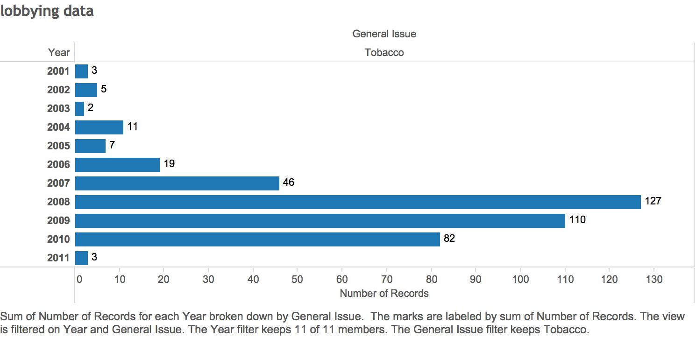

***The Esteemed Creators:*** *Juliette Seive, David Tran, Boris Boukhonine*
___
___

***Get data frames***

```{r}
source("../01 Data/package_loader.R", echo = FALSE)
source("../01 Data/dataframes.R", echo = TRUE)
```
___

***Wrangle data***

```{r}
source("../02 Data Wrangling/datawrangling.R", echo = TRUE)
```
___

***Visualize data***

```{r, fig.width=10,fig.height=10}
source("../03 Visualization/visualizations.R", echo = TRUE)
```
___

**Visualization 3: Line plot of Cigarette Tax in States without smoking bans from 1995-2013**
<br>
<br>


<br><br>

___

**Visualization 1: States that have smoking restrictions in bars, restaurants and private worksites**

<br>


<br>
<br>
<br>

___

**Visualization 2: Type of smoking restriction for each state for 1995-2013**


<br>
<br>
<br>


<br><br><br>
*Here are two states, Arizona and New York respectively, highlighted in the previous visualization*

<br>
<br>
<br>


<br>
<br>


<br><br>

___

**Visualization 4: Map of states with smoking bans with average cigarette tax represented by point size in even-numbered years for 2000-2010**
<br><br>


<br><br>


<br><br>


___

**Visualization 9: Bar Graph of How Many Times the General Issue of Tobacco Usage was Brought up During Lobbying Sessions in the Senate  **
<br><br>


___
